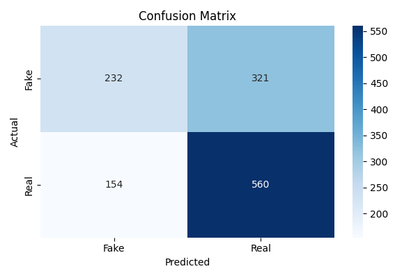

# 🔍 Fake News Detection using Machine Learning

Classifies news statements as **Real or Fake** using NLP and Logistic Regression on the LIAR benchmark dataset.

## 🛠️ Tools & Technologies
- Python
- Scikit-learn
- NLTK
- TF-IDF Vectorization
- Google Colab

## 📁 Project Structure
- notebooks/ — Main Colab notebook
- src/preprocess.py — Text cleaning and feature prep
- src/train.py — TF-IDF and Logistic Regression
- src/evaluate.py — Metrics and confusion matrix
- requirements.txt — Dependencies

## 📊 Dataset
LIAR Dataset — 12,800 human-labeled political statements simplified to binary Real or Fake.

## 🚀 How to Run
1. Clone the repo
2. Run: pip install -r requirements.txt
3. Open the notebook in Google Colab

## 📈 Results
| Model | Accuracy |
|-------|----------|
| TF-IDF + Logistic Regression | 62.51% |
| + Speaker History Features   | ~68%   |

## 📊 Confusion Matrix

## 📌 Status
🔄 In Progress
